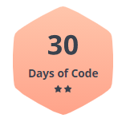

# <h1 align="center"> HackerRank Challenges</align>

 

### Welcome to 30 days of Javascript

Problems solved by [**Riller Vincci**](https://www.hackerrank.com/rillervincci), exploring [_HackerRank_](https://www.hackerrank.com/) platform to learn and improve programming skills.

If you are learning from Hackerrank, do not copy the codes, read the comments carefully and develop your own solutions!!!

 

#### [Day 0: Hello World](day0.js)

Saving a line of input from stdin to a variable and printing it as 'Hello, World.'

#### [Day 1: Datatypes](day1.js)

Sum of two integer variables, two double variables and concatenation of a string.

#### [Day 2: Operations](day2.js)

Given the meal price, tip percent and tax percent, the final cost is printed.

#### [Day 3: Conditional Statements](day3.js)

Conditional statements to check if a value is odd or even.

#### [Day 4: Class and Instance](day4.js) **Interesting Solution**

Class and Instace to check an age and return if a person is young, teenager or old.

#### [Day 5: Loops](day5.js)

Using loops to print the first 10 multiples of an integer.

#### [Day 6: Review](day6.js)

Review: Expanding knowledge of strings, combining it with loops.

#### [Day 7: Array](day7.js) **Interesting Solution**

Array data structure: checking an array and showing its reverse.

#### [Day 8: Map and Dictionary data structure](day8.js) **Interesting Solution**

Given N names and phone numbers, assemble a phone book that maps friends' names to their respective phone numbers.

#### [Day 9: Recursion](day9.js)

Algorithmic concept called recursion using factorial(n)

#### [Day 10: Binary](day10.js)

Binary
